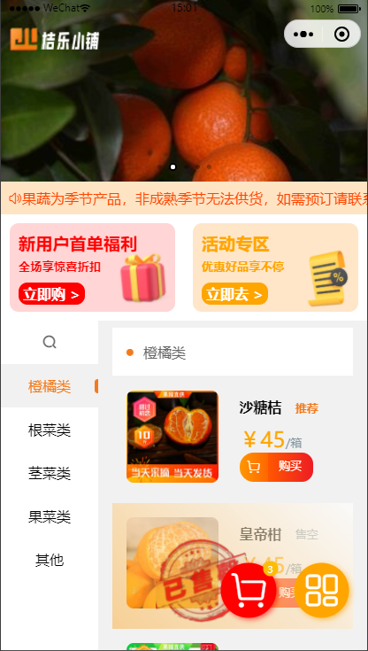
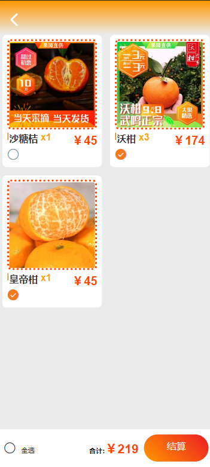
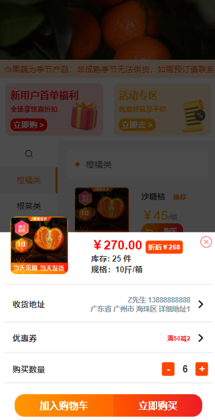
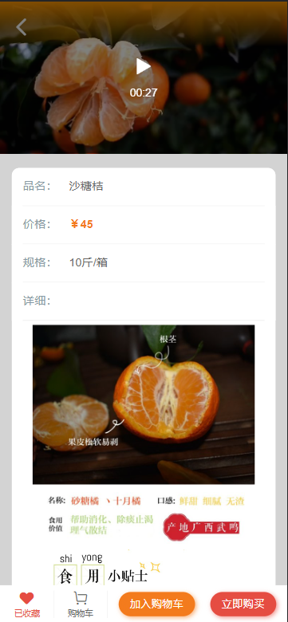
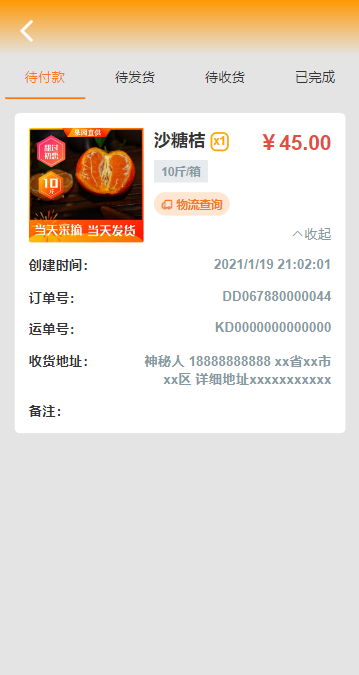

### FruitStore

uniapp + ColorUI 微信水果店铺（不含后端）
<!-- 说是uniapp+colorui 但是uniapp的组件没用到几个 colorui的使用也不是彻底 :) -->
-  "vue": "^3.2.33",
-  "vuex": "^4.0.2"
-  "vite": "^2.9.6"
-  "@dcloudio/uni-mp-weixin": "^3.0.0-alpha
  
一些图片资源的来源：
https://free3dicon.com/
https://www.iconfont.cn/
http://www.fszhongnan.com/

### 大概界面框架

- 主页面
  - 商品展示
    - 顶部轮播图
    - 公告
    - 商品分类展示

  - 用户菜单
    -  头像昵称
    -  我的收藏
    -  我的订单
       - 订单分类（待付款，待发货，已发货，已完成）
       - 展示* 
    -  地址管理
       - 添加删除  
    -  优惠券
    -  建议反馈
    -  关于店铺
    -  后台数据管理（admin）
  - 购物车 
    
